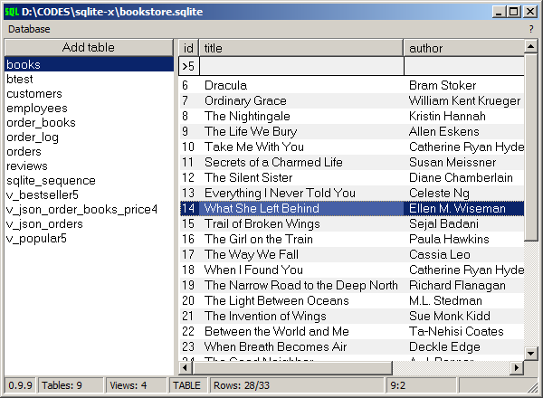

sqlite-x is the simplest [SQLite](https://www.sqlite.org/index.html) viewer for Windows users who do not need to write queries. 

|[**Download the latest version**](https://github.com/little-brother/sqlite-x/releases/latest)|
|-------------------------------------------------------------------------------------------|

### Features
* Column filters
* Sort data by column click
* Data editing
* Doesn't require SQLite library (built-in)
* Supports huge tables
* Blob export

Need more? Try [sqlite-gui](https://github.com/little-brother/sqlite-gui)!

If you have any problems, comments or suggestions, check [Wiki](https://github.com/little-brother/sqlite-x/wiki), create [issue](https://github.com/little-brother/sqlite-x/issues) or just let me know <a href="mailto:lb-im@ya.ru?subject=sqlite-x">lb-im@ya.ru</a>.